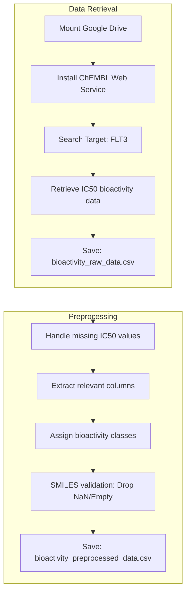

# Assignment 2: QSAR Data Curation and Preprocessing for FLT3

### Bioactivity Data Retrieval and Curation for QSAR Modeling.

### **Selected Target**
* **Target Name:** Receptor-type tyrosine-protein kinase FLT3 (FMS-like tyrosine kinase 3)
* **ChEMBL ID:** [CHEMBL1974](https://www.ebi.ac.uk/chembl/target_report_card/CHEMBL1974/)
* **UniProt ID:** P36888
* **Organism:** *Homo sapiens*

### **Dataset Statistics**
* **Initial records collected:** 7096 records 
* **Final preprocessed records:** 6960 records 

### **Data Curation Workflow**
The following diagram and description outline the step-by-step process used to curate the dataset:

#### **Data Curation Workflow Description**
The data curation process was executed in two primary stages:

#### I. Data Retrieval: 
After establishing a connection between Google Colab and Google Drive, the ChEMBL web service client was utilized to identify the FLT3 target (CHEMBL1974). Bioactivity records specifically reported as IC50 values in nanomolar (nM) units were retrieved.

#### II. Data Preprocessing:
* Data Cleaning: Records with missing or null IC50 values were identified and removed to maintain dataset quality.
* Activity Classification: Compounds were categorized into three distinct classes—Active (IC50 ≤ 1000 nM), Inactive (IC50 ≥ 10000 nM), and Intermediate—to provide a structured basis for QSAR modeling.
* Structural Validation: A rigorous check of chemical structures was performed; all entries with missing, empty, or invalid SMILES strings were discarded to ensure compatibility with future molecular descriptor calculations.
* File Management: The raw data and the final preprocessed dataset were exported as CSV files to the designated /data folder on Google Drive.
